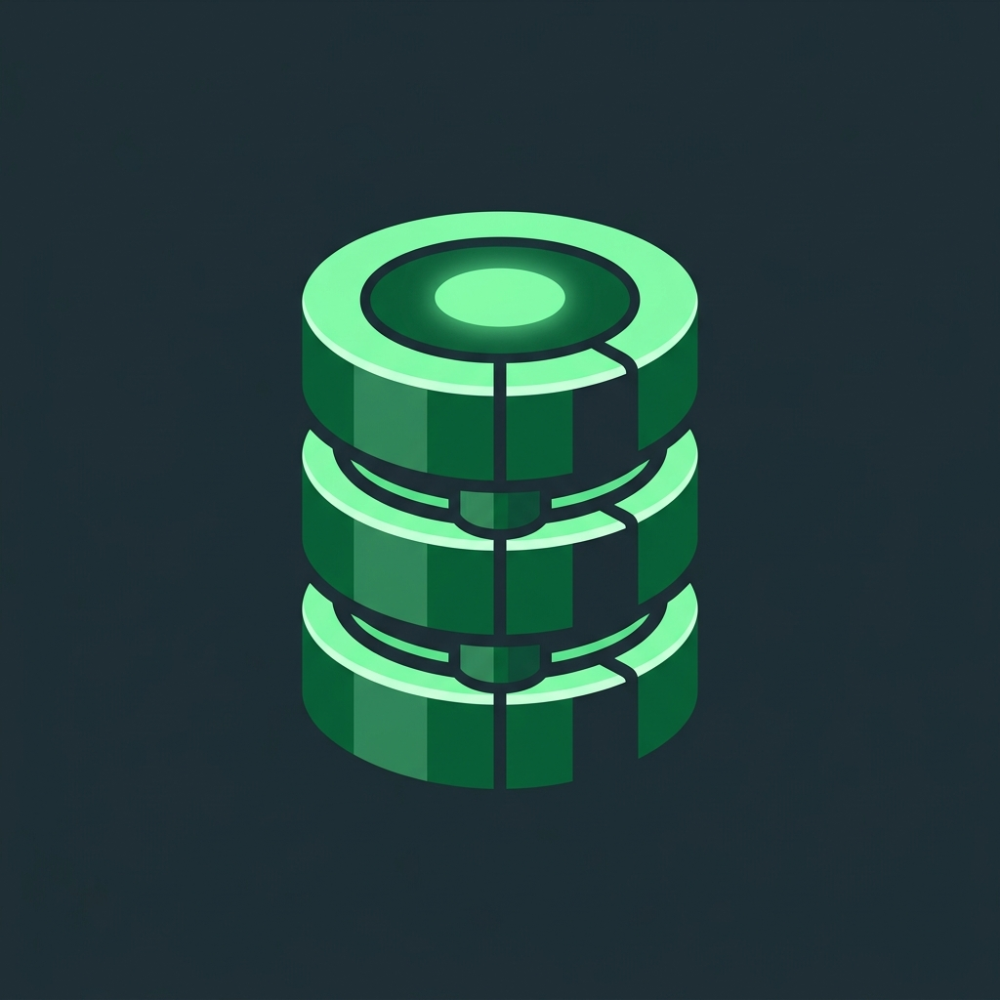

<p align="center">
  
  <h1 align="center">SreeBase</h1>
  <p align="center"><strong>An educational, bracketless NoSQL document database built in Python to explore database internals.</strong></p>
  <p align="center">
    <a href="https://github.com/gowthamrdyy/sreebase/actions"></a>
    <a href="https://github.com/gowthamrdyy/sreebase/blob/main/LICENSE"></a>
    <a href="https://github.com/gowthamrdyy/sreebase/releases"></a>
    <a href="https://python.org"></a>
  </p>
</p>

---

## 🧠 What is SreeBase?

SreeBase is a lightweight, document-oriented NoSQL database written entirely in pure Python. Instead of using standard JSON or SQL, it features a custom, indentation-based query language parsed through a bespoke recursive-descent lexer and parser. Under the hood, SreeBase manages data using a Bitcask-style append-only log for disk storage and maintains O(1) hash-map secondary indexes in memory.

## 🚀 Why SreeBase was built

SreeBase was created as an educational tool for developers, students, and systems enthusiasts to demystify database engineering. Production databases often act as black boxes; SreeBase exists to expose the raw mechanics of storage engines, custom AST compilation, background log compaction, and binary TCP protocols. It is designed specifically for learning, teaching, and experimentation rather than production use, demonstrating how to build a fully functional database engine from scratch without relying on complex C-level dependencies.

## ✨ Key Features

- **Bitcask-style Append-Only Log:** Data is written sequentially (`.sree` files) for near-instantaneous disk I/O, avoiding the massive write-amplification overhead of B-Trees.
- **Group Commit & Manual Compaction:** Write paths support batched `fsync` grouping. Compaction rewrites live records under an exclusive lock for simple, correct log cleanup.
- **Custom AST & Parser:** A bespoke lexer and recursive-descent parser. No JSON brackets required. Write queries like plain English.
- **O(1) Secondary Indexes:** Hash-map based secondary indexing directly in RAM that stays perfectly in sync with mutations.
- **Aggregation Pipeline:** Powerful `aggregate` syntax supporting filtering (`where`), grouping (`group by`), and statistical math (`sum()`, `avg()`, `count()`).
- **Basic RBAC:** Role-based access control separates admin and read-only users. Passwords are stored with salted PBKDF2 hashes, but the TCP protocol does not provide TLS, rate limiting, or account lockout.

## ⚖️ SreeBase vs SQLite

While both are lightweight databases, they serve entirely different purposes. SQLite is the industry standard for production-ready embedded storage, whereas SreeBase is a NoSQL learning project focused on exploring database design patterns in Python.

| Feature | SreeBase | SQLite |
| :--- | :--- | :--- |
| **Primary Use Case** | Educational exploration of database internals | Production-grade embedded applications |
| **Data Model** | Document (NoSQL) | Relational (SQL) |
| **Query Language** | Custom bracketless (indentation-based) | Standard SQL |
| **Storage Architecture** | Bitcask-style append-only log | B-Tree |
| **Core Language** | Pure Python | C |
| **Concurrency** | Basic thread-locking | Advanced locking & WAL |
| **Transactions** | None | Fully ACID compliant |
| **Insert Performance (10k records)** | ~0.23 seconds | ~0.004 seconds |

## ⚡ Quick Start

SreeBase is actively in development. You can install it globally on your machine directly from GitHub using `pipx` (recommended) or `pip`.

```bash
# Install globally using pipx
pipx install git+https://github.com/gowthamrdyy/SreeBase.git

# OR using standard pip
pip install git+https://github.com/gowthamrdyy/SreeBase.git

# Start the SreeBase TCP server in the background
sreebase serve &
```

Your database is now running on `127.0.0.1:6969`. All data is persistently saved to the `./data` folder in your current directory.

---

## 💻 The Professional CLI

SreeBase comes with an interactive, professional REPL client boasting command history, arrow-key support, and ASCII-rendered tabular results.

### 1. The Bootstrap Setup (First Time Only)
When you spin up a completely fresh database, you must connect anonymously to create your initial admin account.

```bash
# Connect to the shell anonymously
sreebase shell
```

Then, create your root user:
```sql
sreebase> create user admin password "supersecret" role admin
```
Type `exit` to leave. After this first user exists, anonymous queries are rejected and clients must log in.

### 2. Standard Login
From now on, use your `-u` argument to authenticate. The shell hides your keystrokes and prompts for your password:

```bash
# Connect securely
sreebase shell -u admin
```

### Bracketless Querying

Forget trailing commas, curly braces, and nested parentheses. Just type your logic. 
Submit a **blank line** to execute a multi-line query.

```sql
sreebase> insert into employees
      ...     name = "Gowtham"
      ...     department = "Engineering"
      ...     salary = 125000
      ... 

{
  "_id": "f47ac10b-58cc-4372-a567-0e02b2c3d479",
  "inserted": {
    "name": "Gowtham",
    "department": "Engineering",
    "salary": 125000
  }
}
```

```sql
sreebase> aggregate employees
      ...     where
      ...         salary >= 50000
      ...     group by department
      ...     calculate avg(salary), count()
      ... 

+-------------+---------------+-----------+
| department  | avg(salary)   | count()   |
+-------------+---------------+-----------+
| Engineering | 125000.0      | 1         |
+-------------+---------------+-----------+
1 rows in set
```

---

## 🐍 Official Python SDK (`reddybase`)

Building an application? Use the official `reddybase` Python driver for a beautiful, Pythonic ORM that transparently compiles your code into the underlying SreeBase syntax over TCP.

```python
from reddybase.client.driver import Client

# 1. Connect and Authenticate
client = Client(host="127.0.0.1", port=6969)
client.login("admin", "supersecret")

# 2. Get a Collection reference
logs = client.collection("server_logs")

# 3. Insert Data
logs.insert({"server_id": "srv-alpha", "cpu": 95.5, "status": "critical"})

# 4. Query Data (use tuple conditions for comparisons)
critical_logs = logs.get(where={"status": "critical", "cpu": (">", 90)})

# 5. Aggregations
analytics = logs.aggregate(group_by="server_id", calculate=["avg(cpu)"])
```

---
**SreeBase — Engineered with precision.**
